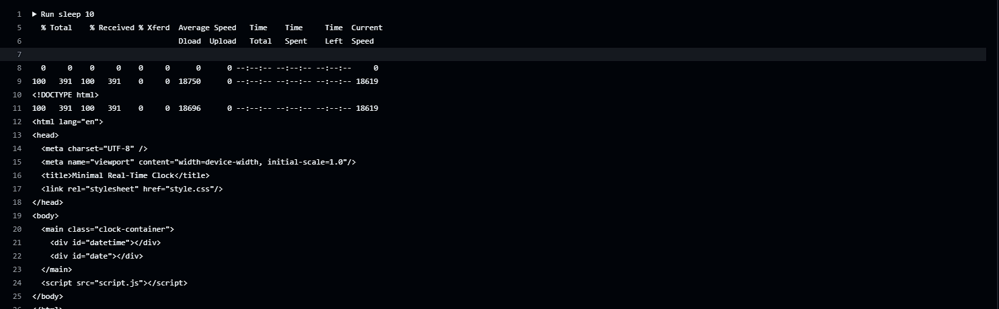

---

 **Date & Time Web App**

*A minimal Node.js Express application that displays the current date and time. Built for containerized deployment with automated CI/CD using Docker and GitHub Actions.*

---

## 🌟 Key Highlights

<p align="left">
   <b>Real-time date & time display</b>  
  <br/>
   <b>Static frontend via</b> <code>public/index.html</code>  
  <br/>
   <b>Fully containerized using Docker</b>  
  <br/>
   <b>Automated CI/CD with GitHub Actions</b>:
  <ul>
    <li>🔨 Build & push Docker image</li>
    <li>🛡️ Scan with Trivy for vulnerabilities</li>
    <li>📡 Test deployment via <code>curl</code></li>
  </ul>
</p>


---

 **CI/CD Pipeline Overview**

This project uses **GitHub Actions** to automate the container lifecycle:

 ** Workflow Breakdown **

#### 🛠️ 1. Build & Push (`docker.yml`)
Triggered on every push to the `main` branch:

- Checks out the code  
- Logs into Docker Hub securely via GitHub Secrets  
- Builds Docker image: `demo-nodeapp-v1:latest`  
- Tags & pushes image to Docker Hub  

```yaml
on:
  push:
    branches:
      - main
```

#### 🛡️ 2. Security Scan (`scan.yml`)
Runs after successful build:

- Pulls the latest Docker image  
- Scans using Trivy for `CRITICAL` and `HIGH` vulnerabilities  
- Outputs results in SARIF format  

```yaml
needs: build
```

#### 🧪 3. Test Container (`test.yml`)
Runs after scan job completes:

- Pulls image from Docker Hub  
- Runs container in detached mode  
- Waits for app readiness  
- Verifies HTTP response via `curl`  

```yaml
needs: scan
```

---

 **CI/CD Workflow Visuals**

> _Insert your workflow screenshots here for visual reference_

- 

---

  **Local Development**

**Pre-requisite**: Node.js installed

```bash
# Clone and run
git clone https://github.com/<your-username>/<repo-name>.git
cd <repo-name>
npm install
node app.js
```

🔗 Access app at: [http://localhost:3000](http://localhost:3000)

---

 **Docker Usage**

```bash
# Build Docker image
docker build -t demo-nodeapp-v1 .

# Run container
docker run -p 3000:3000 demo-nodeapp-v1
```

---

 **GitHub Secrets Setup**

Configure the following secrets in your repo:

| Secret Name      | Purpose                        |
|------------------|--------------------------------|
| `DOCKERUSERNAME` | Docker Hub username            |
| `DOCKERPASSWORD` | Docker Hub password or token   |

📍 Go to: `Settings → Secrets and variables → Actions`

---

 **Workflow File Summary**

| File            | Description                                      |
|------------------|--------------------------------------------------|
| `docker.yml`     | Builds & pushes Docker image to Docker Hub       |
| `scan.yml`       | Performs Trivy scan for vulnerabilities          |
| `test.yml`       | Runs container & validates app with `curl`       |

---

## 🔍 Trivy Scan (Manual)

```bash
docker pull <your-image>:latest
trivy image <your-image>:latest
```

---

## ✅ Automated Testing via GitHub Actions

- Pulls image from Docker Hub  
- Runs container in background  
- Waits for a few seconds  
- Verifies with `curl` on port 3000  

---

## 📁 Project Structure

```plaintext
├── app.js
├── package.json
├── public/
│   └── index.html
├── Dockerfile
└── .github/
    └── workflows/
        ├── docker.yml
        ├── scan.yml
        └── test.yml
```

---

## 📤 Output & Results

Once the CI/CD pipeline runs:

- ✅ Image is built and pushed  
- 🔍 Trivy scan confirms vulnerability status  
-   App is deployed and tested successfully  

### 💻 Sample `curl` Response

```bash
$ curl http://localhost:3000
Current Date & Time: 2025-08-04 20:08:00
```



---

## 📜 Logs & GitHub Actions Summary

Each workflow job produces useful logs for debugging and validation:

| Job           | Logs & Output                            |
|---------------|-------------------------------------------|
| Build & Push  | Docker layer logs, image tag confirmations |
| Trivy Scan    | Security summary, SARIF logs, exit codes  |
| Test Job      | Container boot, `curl` response check     |

-   
-   
-   


---

